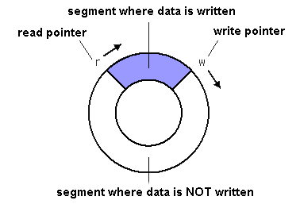
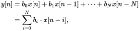

### The George Washington University
## CSCI 3410 Systems Programming
# Homework 0 - Circular Buffers

**Due Date:** Wednesday Feb 5, 2020 at 11:59 PM

This is an *individual assignment*, you may not collaborate or share code with other students.

#### Background Information

The *ring buffer* is a commonly used data structure in embedded systems. This data structure is a First In First Out (FIFO) buffer implemented using a fixed-length buffer in memory as if it was connected end-to-end. That is, data can "wrap around" and continue at the beginning of the memory region. The ring buffer is commonly used as the backing store for a fixed length FIFO queue for this reason. Ring buffers are often used in embedded systems due to their fixed size (which means the memory requirements are finite and known ahead of time) and fast operations. Often, this data structure is implemented using two pointers, one that refers to the next index to be written at and the other at the next location to be read.

The ring buffer is often implemented with the following data structure:

``` {.c}
struct ring {
        unsigned int size;  // Capacity of the buffer
        unsigned int read;  // Index of the next item to be read
        unsigned int write; // Index of the next item to be written
        short *data;        // Array storing the buffer data
};

```

{width=40%}

The second concept we will examine in this assignment is the *Finite Impulse Response filter* (or FIR Filter). We will be focusing on the *casual discrete time FIR filter*. This means that the filter only depends on its current and past values, each of which occur at a distinct "point in time". Imagine you have a finite buffer of the $N$ most recent values coming from a sensor. However, you know that the sensor readings contain a lot of noise which you want to eliminate before processing. We can use a casual discrete time FIR filter to compute a weighted sum of the last $N$ points (based on a known weighting for each reading). We will use this filter to compute a moving average. The formula for the filter is as follows:

{width=40%}

### System Specification

You will implement a ring buffer (in the file `ring.c`) using the data structure given above that conforms to the following abridged API (the full specification can be found in `ring.h`):

 - `int ring_size(struct ring *ring)`: Compute the number of items currently enqueued on the ring buffer.
 - `int ring_enqueue(struct *ring, short data)`: Adds an item to the ring buffer, if there is space available. If the buffer is full, return -1.
 - `int ring_dequeue(struct *ring, short *datap)`: Removes an item from the ring buffer and stores it at the location pointed to by `datap`. If the buffer is empty, return -1.
 - `double ring_apply_fir(struct ring *ring, double *weights)`: Apply a FIR filter to the current contents of the buffer. This should not change the buffer's state (e.g. it should not dequeue anything). This function is passed an array of weights to be used (they are provided to correspond to the order which the items are read - the first weight is for the item pointed at by the buffer's read pointer).

We will then use this ring buffer to investigate how we can apply a moving weighted average to remove noise from a given signal. Code to accomplish this has been proved in `filter.c`. Be warned, the provided code assumes that your ring buffer implementation follows the given specification, so be sure your code is correct!

### Report Specification

You will submit a report that summarizes your findings. Be sure to include the following things:

 - Pseudocode that describes the algorithms for the following ring buffer functions: `ring_size`, `ring_enqueue`, `ring_dequeue`, and `ring_apply_fir`.
 - The time complexity (in "Big-Oh Notation") of each function. You may assume that each call to the standard library takes constant time. Describe why these time complexities make the ring buffer a favorable choice for embedded and real-time systems.
 - Plots of the three waves generated by the example code: the original `sin` wave, the wave with added noise, and your filtered wave. After you run the provided filter code, you can run `make plot` to generate these graphs. This will require the program [`gnuplot`](http://www.gnuplot.info/) to be installed. If needed, the program should be installed on the SEAS Shell (`shell01.seas.gwu.edu`).
 - An analysis of, in your opinion, if the filter was effective at reducing the noise in the wave. You may use the generated audio files and wave plots to support your conclusion. Furthermore, provide insights into the trade-offs created by changing the ring buffer size or filter weights.

### Testing

First off, you want to ensure that your ring buffer conforms to the given specification. A test file has been provided (`test_ring.c`). You can run it using the command `make test`. If all the tests pass, you can safely assume that your ring buffer implementation is "in-spec". Note that this test file does not exhaustively test every possible edge cases, but attempts to ensure that the "common case" operations function as intended. Your code may still have bugs, even if all the tests pass.

Second, you may test your FIR filter implementation using the filter program provided (compile with `make filter` and run with `./filter`). This program does the following things:

 - Generate a sin wave (enough samples for a 5 second audio file)
 - Add some random noise to the generated wave
 - Build FIR Filter weights (in this case, all weights are equal so we compute a moving average)
 - Apply the FIR Filter to the samples using your ring buffer

For each of the three waves (the clean wave, noisy wave, and filtered wave), the `filter` program generates a `wav` audio file and a `csv` file of some samples. To easily see the differences between the multiple waves, audio files of each are also generated. You can play the `wav` files using the program [VLC](https://www.videolan.org/vlc/index.html). You can launch the program to play a certain file with the following command: `vlc clean.wav`. You can generate plots of the `csv` files using `make plot` as described above.

### Implementation Tips

 - First, write the pseudocode portion of the report and really think through how each function should operate. This will allow you to build a conceptual understanding of the data structure before you attempt implementation. For a refresher on how to write good pseudocode, see [this page](http://www.wikihow.com/Write-Pseudocode).
 - Think about how to detect when the buffer is empty and when the buffer is full. You may notice that the same condition is true for both (the read and write pointers are equal) - while correct, this approach may make all the implementation's edge cases difficult to nail down. Instead, you can allocate the data buffer with an extra item at the end (that will never be used). This will allow you to more easily determine when the buffer is full and when it is empty.
 - You will **need** to use dynamic memory allocation to complete this assignment. If you need your memory refreshed, refer to the `man` pages: `man malloc` and `man free` for complete details of how the functions are used.
 - If you encounter difficulty getting your program to work, recall that you can use the GNU Debugger (or `gdb`) to gain insight into how your program is running. You should already be familiar with using `gdb`, but you can find documentation [here](https://sourceware.org/gdb/current/onlinedocs/gdb/).

#### Deliverables and Grading

 * Push your code to GitHub (a link will be posted on Blackboard) before the deadline.
 * All of your code (including your tests) should compile with the following `gcc` flags: `-std=c99 -Wall -pedantic -Werror`. You will lose credit if your code compiles, but only without those extra flags.
 * Be sure to write clear and concise commit messages outlining what has been done.
 * Write clean and simple code, using comments to explain what is not intuitive. If the grader cannot understand your code, you will lose credit on the assignment.
 * Be sure your code compiles! If your program does not compile, you will receive **no credit**. It is better to submit a working program hat only does a subset of the requirements than a broken one that attempts to do them all.

| Category                                   | Percentage |
|:------------------------------------------:|:----------:|
| Instructor Tests Pass                      | 40%        |
| Report                                     | 30%        |
| Code Quality & Implementation              | 20%        |
| Compilation with `-Wall -pedantic -Werror` | 10%        |

Table: Grading Rubric
